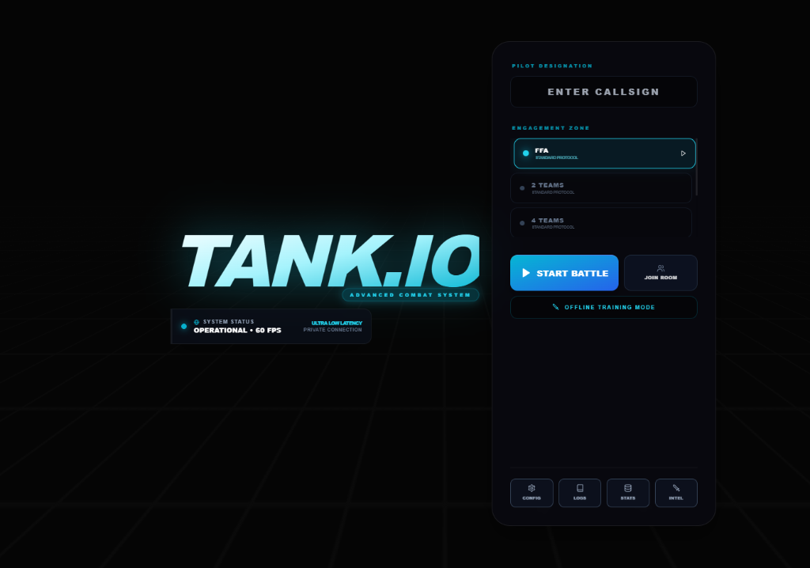
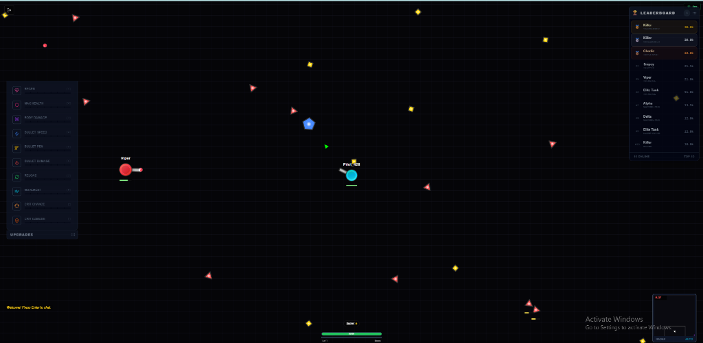
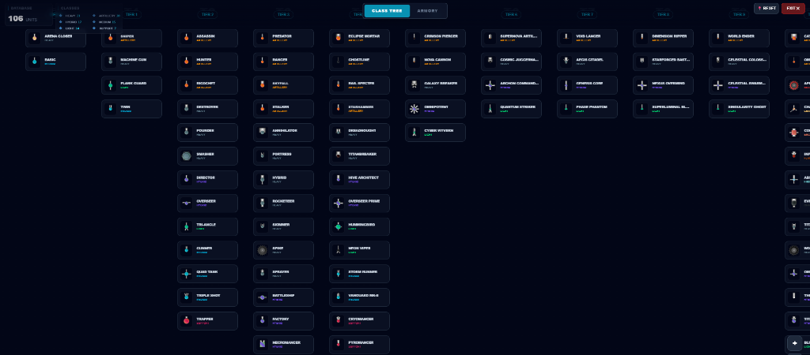
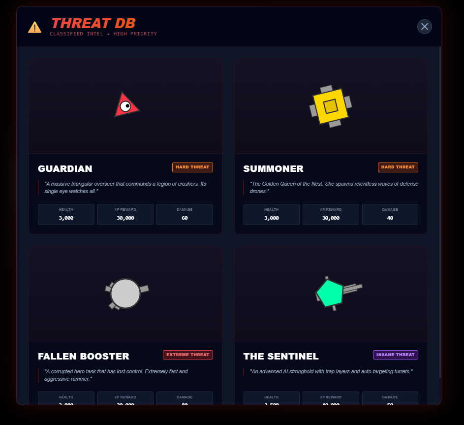
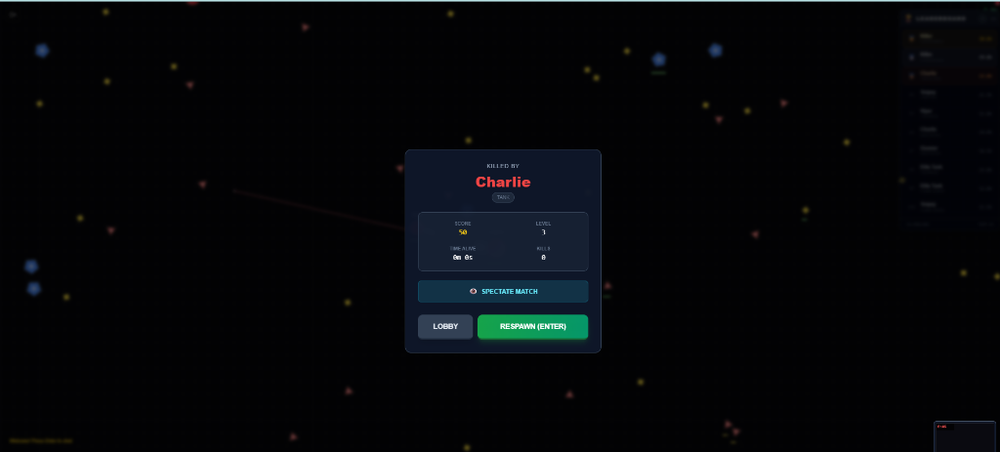

# 🛡️ TANK.IO: ULTIMATE EDITION (Production Ready)

เกมรถถัง IO แบบ Multiplayer ของจริงที่ถูกพัฒนาด้วยเทคโนโลยีล่าสุด เพื่อมอบประสบการณ์การเล่นที่ลื่นไหลระดับ 60 FPS พร้อมระบบกราฟิกแบบ Next-Gen และกลไกการเล่นที่ลึกซึ้ง

## ✨ ฟีเจอร์เด่น (Key Features)

*   **⚡ High-Performance Engine**: รันที่ 60 FPS คงที่ด้วยระบบ Fixed Tick Rate และ Entity Interpolation
*   **🌐 Real-time Multiplayer**: ระบบ Binary WebSocket และการเชื่อมต่อที่เสถียร
*   **📈 Evolution System**: อัปเกรดรถถังได้มากกว่า 100+ รูปแบบ (Classes)
*   **🤖 Smart AI & Bosses**: บอสที่มีความฉลาดและสุ่มเกิดเพื่อความท้าทาย
*   **🛡️ Factions & Skills**: ระบบฝ่ายและสกิลกดใช้ที่หลากหลาย

## 🛠️ เทคโนโลยีและเครื่องมือที่ใช้ (Technical Stack)

-   **Frontend**: React 18, TypeScript, Tailwind CSS, Zustand
-   **Engine**: Canvas 2D API, Custom Physics & Network Manager
-   **Backend**: Node.js, TSX, SQLite, WebSocket (ws)
-   **Tools**: Vite, Lucide Icons, Radix UI

## 🎮 การควบคุม (Controls)

*   **W A S D**: เคลื่อนที่
*   **鼠**: เล็งเป้าหมาย / คลิกซ้าย: ยิง
*   **Space / F**: ใช้สกิลพิเศษ
*   **E / C**: Auto Fire / Auto Spin
*   **1-8**: อัปเกรด Stats

---

## 🚀 วิธีเริ่มเกม (Getting Started)

1.  **ติดตั้ง**: `npm install`
2.  **รันเกม**: `npm run start` หรือรันไฟล์ `คลิกตรงนี้เพื่อเริ่มเกม.bat`

**Engine Powered by:** React, Vite, TSX, SQLite, Binary Protocol